# Matplotlib

1. [Getting started](#schema1)
2. [Subplots](#schema2)
3. [Types of plots](#schema3)
4. [Leyendas ](#schema4)
5. [Object oriented plots](#scema5)

# 1. Getting started
1º Importar Matplotlib
~~~python
import matplotlib.pyplot as plt
~~~
Y casi siempre vamos a necesitar `numpy` y `pandas`
~~~python
import pandas as pd
import numpy as np
~~~

2º Hacer el primer plot
~~~python
plt.plot(x,y)
~~~
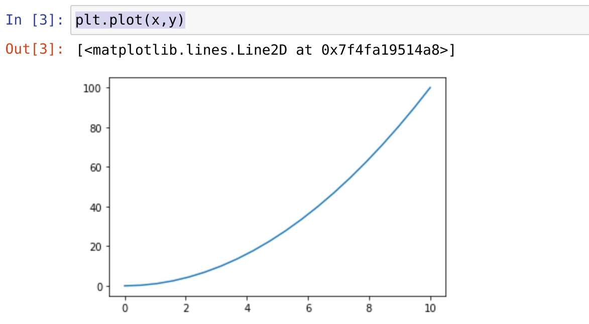

3º Añadir títulos a los ejes y ponerle un título
~~~python
plt.plot(x,x)
plt.xlabel('x-axis')
plt.ylabel('y-axis')
plt.title('First title')
~~~
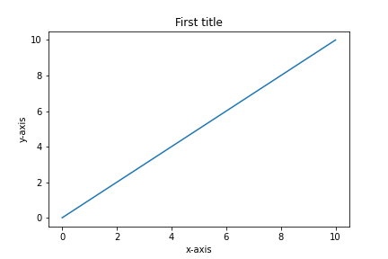

# 2. Subplots
Crear varios conjutos de ejes devolviendo una referencia a la figura y a los ejes.
~~~python
plt.subplot(3,2,1)
plt.subplot(3,2,2)
plt.subplot(3,2,3)
plt.subplot(3,2,4)
~~~
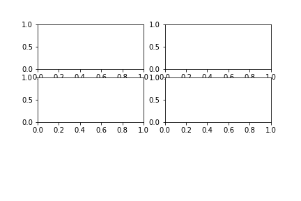

Crear los subplots con una separación
~~~python
plt.subplot(3,2,1)
plt.subplot(3,2,2)
plt.subplot(3,2,3)
plt.subplot(3,2,4)
plt.tight_layout()
~~~
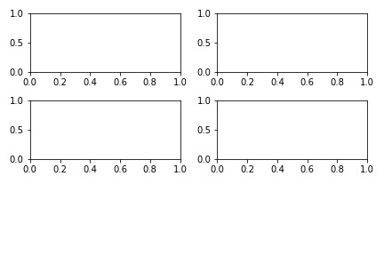

Dibujar en algún subplot
~~~python
plt.subplot(3,2,1)
plt.subplot(3,2,2)
plt.plot(x,y)
plt.subplot(3,2,3)
plt.subplot(3,2,4)
plt.plot(x,x)
plt.tight_layout()
~~~
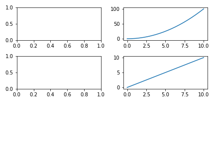
Ponerle a cada uno de los subplot sus leyendas para los ejes
~~~python
plt.subplot(3,2,1)
plt.plot(y,x)
plt.xlabel('x-axis')
plt.ylabel('y-axis')
plt.subplot(3,2,2)
plt.plot(x,x)
plt.xlabel('x-axis')
plt.ylabel('y-axis')
plt.tight_layout()
~~~
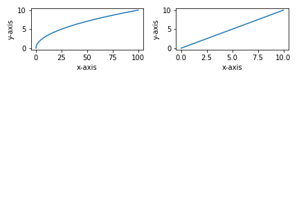

# 3. Types of plots

Hay distintos tipos de plots, vamos a ver algunos.
~~~python
plt.plot(x,y)
~~~
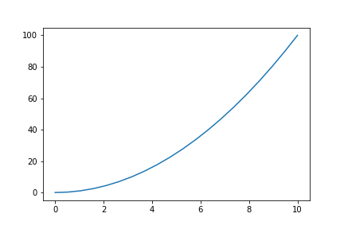
~~~python
plt.scatter(x,y)
~~~
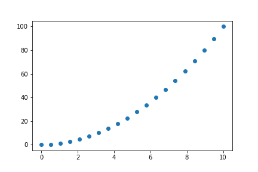

~~~python
plt.hist(x,y)
~~~
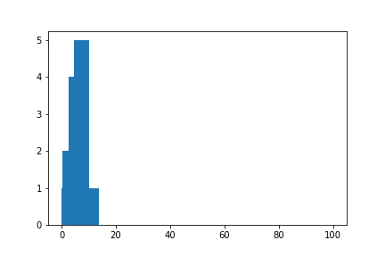

~~~python
plt.bar(x,y)
~~~
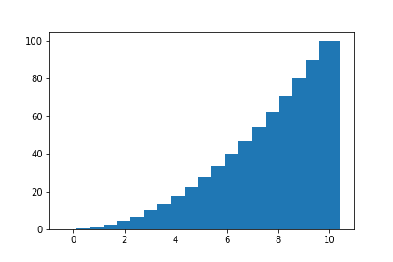

~~~python
plt.fill(x,y)
~~~
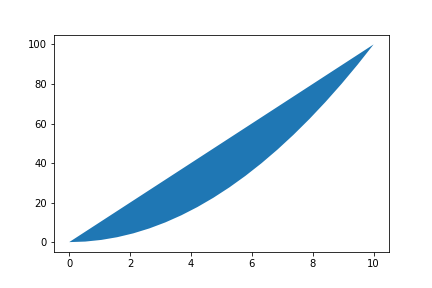

~~~python
plt.polar(x,y)
~~~
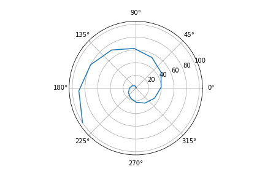

# 4. Legends

Para poner las leyendas en las visualiaciones se pone:
~~~python
plt.plot(x,y,label = 'First example')
plt.legend()
~~~
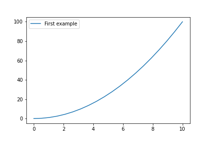

Poner la leyenda para cada eje
~~~python
plt.plot(x,y,y,x,label = 'First example')
plt.legend()
~~~
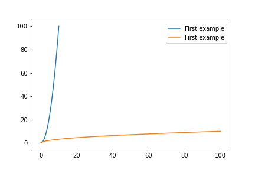

Cambiar la posición de la leyenda
~~~python
plt.plot(x,y,y,x,label = 'First example')
plt.legend(loc = 2)
~~~

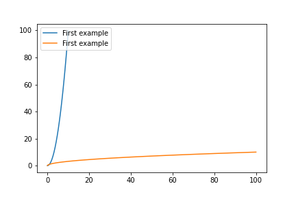
~~~python
plt.plot(x,y,y,x,label = 'First example')
plt.legend(loc = 10)
~~~

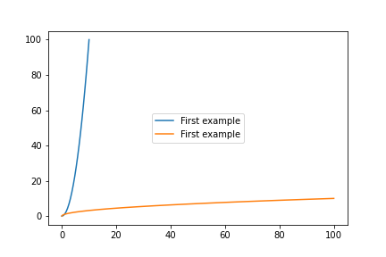

# 5. Object oriented plots

Cambiar el tamaño de los ejes

~~~python
fig = plt.figure()
axes = fig.add_axes([0.1,0.1,1,1])
~~~
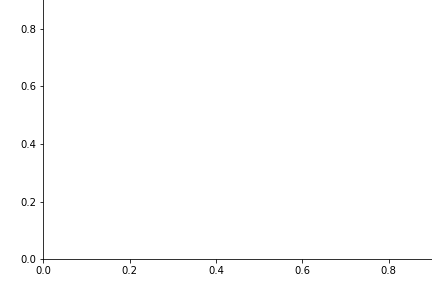

~~~python
fig = plt.figure()
axes = fig.add_axes([0.1,0.3,1,1])
~~~
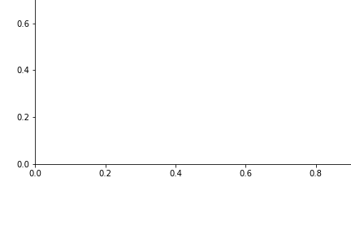

~~~python
fig = plt.figure()
axes = fig.add_axes([0.1,0.3,1,1])
axes.plot(x,y)
~~~
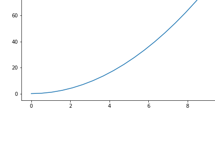